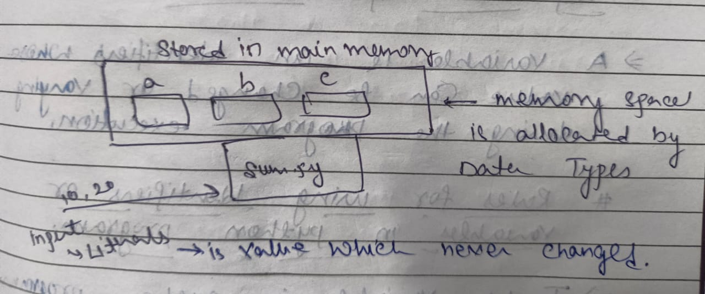

# DATA REPRESENTATION IN PYTHON PROGRAMMING

### What is data and purpose od data 
- Processed information is called data
- The purpose of collecting data is that "To take effective decisions"
## Types of Literals or values or Data
- In programming languages, in general we have 5 types of literals. They are 
  1. Integer Literals
  2. Float Literals
  3. String Literals
  4. Boolean Literals 
  5. Collection Literals
## Memory Diagram


## Importance of identifiers and Variables
- In any programming language, literals must be stored in main memory by allocating sufficient amount of memory space with the help of data types.
- We know all type of literals are stored in main memory by having memory space
- To process values which are present in memory space, programmers must give distinct names to created memory space. These distinct names makes us to identify the values present in memory space.Hence they are called *IDENTIFIERS* .
- The identifies values are changing/varying during program execution and hence identifiers are called *VARIABLES*.
### Definition of variables
- A variable is an identifiers whose value can be changed or varying during the program execution.
- All variables in python are called object.

## Rules for using identifiers or variables in python program
- To use variables in python program we follow the following rules.
**Rule 1.** 
- The Variables names is a combination of Alphabets, Digits and special symbol underscore (_).
  **Rule 2.**
- The first letter of variable name must start with either Alphabet or underscore(_) only.
*Ex->*```
  sal = 56
  _sal = 45
  -sal = 97 # syntax error because it start with hyphen not underscore
  sal$ = 97 # syntax error because it use special symbol $ we can only use (_)
  __sal = 45
  _ = 45 
  123 = 23 # syntax error because first letter must start with alphabet or (_). ```

**Rule 3.**
- Within the variables, No special symbols are allowed except underscore (_).
*Ex->* ```
   emp sal = 56 #syntax error because it have space
    emp-sal = 45 # syntax error because it have hyphen
    emp_sal = 46 # correct
    emp$sal = 84 # syntax error because it use special symbol $
    emp1sal = 34 # correct 
    ```
**Rule 4.**
- No keywords to be used as Variables Name, because keywords are the reserved words and they give special meaning to the compilers.
*Ex->* ```
while = 56 # syntax error it is keyword
while1 = 45 # correct
for = 45 # syntax error it is keyword
for4 = 45 # correct
False = 34 # syntax error it is keyword
false = 22 # correct
``` 
- To get keyword
``` import keyword
    #keyword.kwlist
    ```
**Rule 5.**
- All the variable name are case sensitive.
*ex->*
```
age = 74
Age = 76
aGe = 34 
AGE = 36
print(age,Age,aGe,AGE)
```
## Data types In python

- 


-  